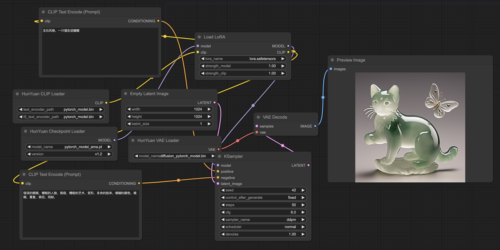
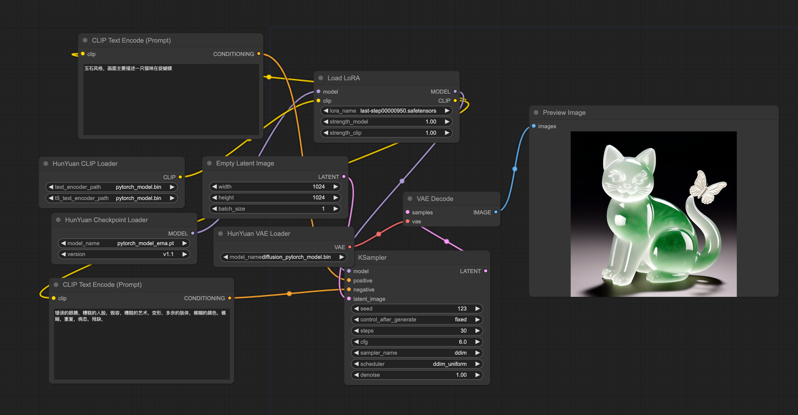
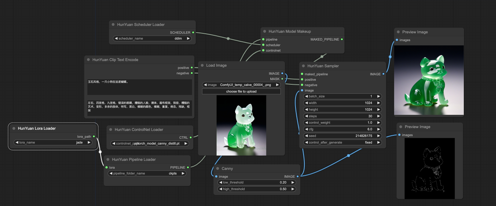

# comfyui-hydit
The ComfyUI code is under review in the official repository. Meanwhile, a temporary version is available below for immediate community use.
We welcome users to try our workflow and appreciate any inquiries or suggestions.


## Overview
- Support two workflows: Standard ComfyUI and Diffusers Wrapper, with the former being recommended.
- Support HunyuanDiT-v1.1 and v1.2.
- Support module, lora and clip lora models trained by Kohya.
- Support module, lora models trained by HunyunDiT official training scripts.
- ControlNet is coming soon.

### Standard Workflow (Recommended)
- [HunyuanDiT-v1.2](workflow/workflow_v1.2_lora.json)


- [HunyuanDiT-v1.1](workflow/workflow_v1.1_lora.json)


### Diffusers Wrapper
- [HunyuanDiT-v1.1-diffusers](workflow/workflow_lora_controlnet.json)



## Usage
### Dependencies

1. Official ComfyUI Environment Setup
```shell
# Please use python 3.10 version with cuda 11.7
conda create --name comfyui-hydit python=3.10
conda activate comfyui-hydit

# Download comfyui code
git clone https://github.com/comfyanonymous/ComfyUI.git
cd ${ComfyUI}
git reset --hard 90389b3b8a69c08c3ed0bcc9d87a92246578a8e3

# Install torch, torchvision, torchaudio
pip install torch==2.0.1 torchvision==0.15.2 torchaudio==2.0.2 --index-url https://download.pytorch.org/whl/cu117 --default-timeout=100 future

# Install Comfyui essential python package
pip install -r requirements.txt
```

2. HunyuanDiT Environment Setup in ComfyUI
```shell
# Move to the ComfyUI custom_nodes folder and copy comfyui-hydit folder from HunyuanDiT Repo.
cd ${ComfyUI}/custom_nodes
git clone https://github.com/Tencent/HunyuanDiT.git
cp -r HunyuanDiT/comfyui-hydit ./
rm -rf HunyuanDiT
cd ${ComfyUI}/custom_nodes/comfyui-hydit

# Install some essential python Package.
pip install -r requirements.txt
```

3. (Optional) Deployment on Windows environment
```shell
cd ${ComfyUI}/custom_nodes
git clone https://github.com/Tencent/HunyuanDiT.git
xcopy /E /I HunyuanDiT\comfyui-hydit comfyui-hydit
rmdir /S /Q HunyuanDiT
cd ${ComfyUI}/custom_nodes/comfyui-hydit
# Install some essential python Package.
pip install -r requirements.txt
```

4. Running ComfyUI successfully
```shell
# Go to ComfyUI main folder
cd ${ComfyUI}
# Run the ComfyUI Lauch command
python main.py --listen --port 80
```

### Standard workflow (Recommended)

1. Preparing Model Weights 

    Download the file to the specified folder using the command below. For additional download links, visit [doc](https://github.com/Tencent/HunyuanDiT?tab=readme-ov-file#-download-pretrained-models). 
    ```shell
    # (Optional) download pretrain-weight
    huggingface-cli download Tencent-Hunyuan/HunyuanDiT-v1.2 --local-dir ${HunyuanDiT}/ckpts
    # clip
    ln -s ${HunyuanDiT}/ckpts/t2i/clip_text_encoder/pytorch_model.bin ${ComfyUI}/models/clip/pytorch_model.bin
    # mt5
    mkdir ${ComfyUI}/models/t5
    ln -s ${HunyuanDiT}/ckpts/t2i/mt5/pytorch_model.bin ${ComfyUI}/models/t5/pytorch_model.bin
    # vae
    ln -s ${HunyuanDiT}/ckpts/t2i/sdxl-vae-fp16-fix/diffusion_pytorch_model.bin ${ComfyUI}/models/vae/diffusion_pytorch_model.bin
    # base model
    huggingface-cli download Tencent-Hunyuan/Distillation-v1.2 pytorch_model_distill.pt --local-dir ${ComfyUI}/models/checkpoints/
    ```
    Put module weights trained through Kohya or the official script in `${ComfyUI}/models/checkpoints/` to switch model weights in ComfyUI.

2. Preparing LoRa Weights

    ```shell
    # Put LoRa weights trained by Kohya in ComfyUI/models/loras
    cp ${HunyuanDiT}/kohya_ss/outputs/last-step{xxxx}.safetensors ${ComfyUI}/models/loras
    
    # (Optional) Put LoRa weights trained by official scripts in ComfyUI/models/loras
    python custom_nodes/comfyui-hydit/convert_hunyuan_to_comfyui_lora.py \
          --lora_path ${HunyuanDiT}/log_EXP/001-lora_porcelain_ema_rank64/checkpoints/0000100.pt/adapter_model.safetensors \
          --save_lora_path ${ComfyUI}/models/loras/adapter_model_convert.safetensors
    
    # update the `lora.py` file
    cp ${ComfyUI}/custom_nodes/comfyui-hydit/lora.py ${ComfyUI}/comfy/lora.py
    ```

### Diffusers Wrapper
1. Preparing Model Weights

    ```shell
    python -m pip install "huggingface_hub[cli]"
    mkdir models/hunyuan
    huggingface-cli download Tencent-Hunyuan/HunyuanDiT-v1.2 --local-dir ./models/hunyuan/ckpts
    huggingface-cli download Tencent-Hunyuan/HunyuanDiT-v1.2 t2i/model/pytorch_model_ema.pt --local-dir ./models/hunyuan/ckpts/t2i/model
    ```

2. Preparing LoRa Weights

    ```shell
    # Put LoRa weights trained by Kohya in ComfyUI/models/loras
    cp ${HunyuanDiT}/kohya_ss/outputs/adapter_model.safetensors ${ComfyUI}/models/loras
    
    # (Optional) Put LoRa weights trained by official scripts in ComfyUI/models/loras
    # The PEFT diffuser format needs to be converted into the standard ComfyUI format
    python custom_nodes/comfyui-hydit/convert_hunyuan_to_comfyui_lora.py \
          --lora_path ${HunyuanDiT}/log_EXP/001-lora_porcelain_ema_rank64/checkpoints/0000100.pt/adapter_model.safetensors \
          --save_lora_path ${ComfyUI}/models/loras/adapter_model_convert.safetensors
    
    # update the `lora.py` file
    cp ${ComfyUI}/custom_nodes/comfyui-hydit/lora.py ${ComfyUI}/comfy/lora.py
    ```

## Custom Node
Below I'm trying to document all the nodes, thanks for some good work[[1]](#1)[[2]](#2).
### HunYuan Pipeline Loader
- Loads the full stack of models needed for HunYuanDiT.  
- **pipeline_folder_name** is the official weight folder path for hunyuan dit including clip_text_encoder, model, mt5, sdxl-vae-fp16-fix and tokenizer.
- **lora** optional to load lora weight.

### HunYuan Checkpoint Loader
- Loads the base model for HunYuanDiT in ksampler backend.  
- **model_name** is the weight list of comfyui checkpoint folder.
- **version** two option, v1.1 and v1.2.


### HunYuan CLIP Loader
- Loads the clip and mt5 model for HunYuanDiT in ksampler backend.  
- **text_encoder_path** is the weight list of comfyui clip model folder.
- **t5_text_encoder_path** is the weight list of comfyui t5 model folder.

### HunYuan VAE Loader
- Loads the vae model for HunYuanDiT in ksampler backend.  
- **model_name** is the weight list of comfyui vae model folder.

### HunYuan Scheduler Loader
- Loads the scheduler algorithm for HunYuanDiT.  
- **Input** is the algorithm name including ddpm, ddim and dpmms.
- **Output** is the instance of diffusers.schedulers.

### HunYuan Model Makeup
- Assemble the models and scheduler module.  
- **Input** is the instance of StableDiffusionPipeline and diffusers.schedulers.
- **Output** is the updated instance of StableDiffusionPipeline.

### HunYuan Clip Text Encode
- Assemble the models and scheduler module.  
- **Input** is the string of positive and negative prompts.
- **Output** is the converted string for model.

### HunYuan Sampler
- Similar with KSampler in ComfyUI.  
- **Input** is the instance of StableDiffusionPipeline and some hyper-parameters for sampling.
- **Output** is the generated image.

### HunYuan Lora Loader
- Loads the lora model for HunYuanDiT in diffusers backend.  
- **lora_name** is the weight list of comfyui lora folder.

### HunYuan ControNet Loader
- Loads the controlnet model for HunYuanDiT in diffusers backend.  
- **controlnet_path** is the weight list of comfyui controlnet folder.

## Reference 
<a id="1">[1]</a> 
https://github.com/Limitex/ComfyUI-Diffusers  
<a id="2">[2]</a>
https://github.com/Tencent/HunyuanDiT/pull/59  
<a id="3">[3]</a>
https://github.com/city96/ComfyUI_ExtraModels.git# comfyui-hydit
